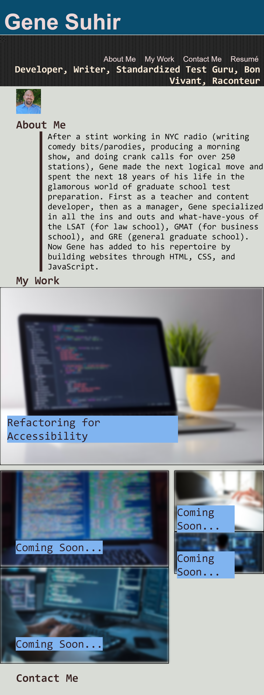

# 02 Second Challenge -- UCSD Coding Bootcamp

## Goal of the Project

This was my first ever attempt at building a site from scratch using HTML and CSS.  It was quite a challenge, and the CSS was reminiscent of the old Groucho Marx bit where he could never quite get one eyebrow the same size as another until they both just got out of hand.  But the idea is to have my portfolio page with a home for upcoming completed projects.  The nav bar on top has 4 links and 3 of take you to the right section of the page.  The "Resume" one currently just links to google.com, but an updated resume will be coming soon.

There is a recent photo and currently the "My Work" section only has 1 assignment that I completed last week that links to the right page.  The other buttons that say "Coming Soon..." currently just link to various websites but will soon link to upcoming projects.

And the "Contact Me" section has my phone number, email and link to my LinkedIn page.

It is hopefully responsive to different screen sizes with a media query, but the biggest challenge was using Flexbox to try get the container with 4 buttons in the "My Work" section to align the way I wanted to.  It's a work in progress.

## Screenshot

## Github Links

https://gsuhir.github.io/Portfolio/

https://github.com/GSuhir/Portfolio

